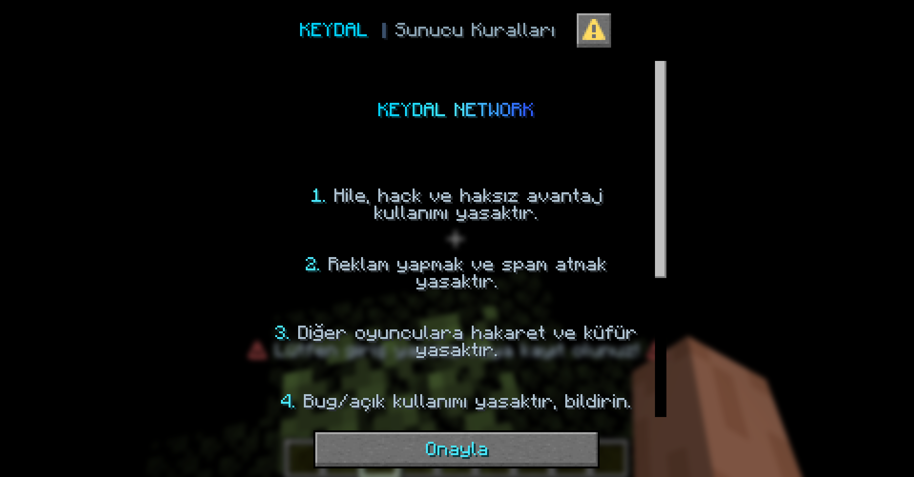
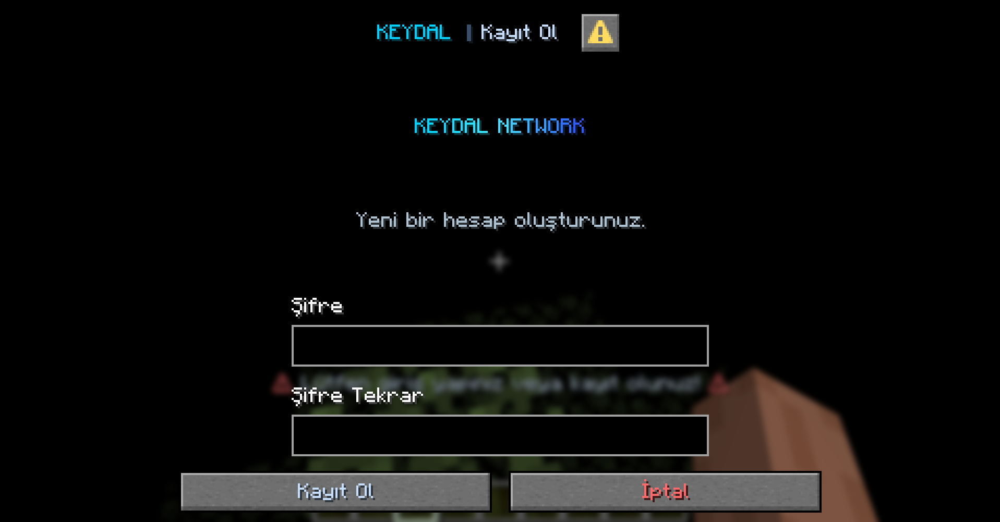
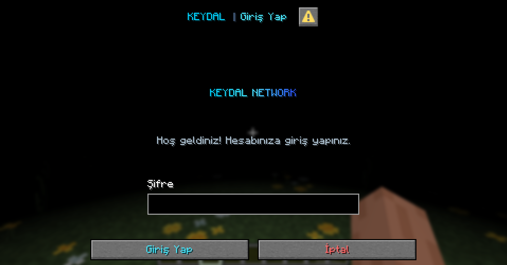

# kAuth

Modern and secure authentication plugin for Minecraft servers. Developed by **KEYDAL Projects**.

Minecraft sunucuları için modern ve güvenli giriş/kayıt sistemi. **KEYDAL Projects** tarafından geliştirilmiştir.

---

## Screenshots / Ekran Görüntüleri

### Rule Agreement / Kural Onayı


### Register / Kayıt


### Login / Giriş


---

## Features / Özellikler

### Authentication / Kimlik Doğrulama
- **Dialog GUI** - Visual login screen on Paper 1.21.5+ clients
- **Chat Fallback** - Automatic chat-based login for older clients
- **PBKDF2-SHA256 Encryption** - Industry standard with 65,536 iterations
- **Timing-safe Verification** - Protection against side-channel attacks

### Security / Güvenlik
- **IP Brute-force Protection** - Per-IP attempt limits with automatic blocking
- **Account Limit** - Maximum accounts per IP address
- **Weak Password Blocking** - Blocks common passwords and username-as-password
- **Session Management** - IP-based session cache for seamless reconnection
- **Detailed Logging** - All login, register, failed attempts and logout events

### User Experience / Kullanıcı Deneyimi
- **Rule Agreement System** - Server rules shown on first registration
- **Last Login Info** - Shows last login IP and time on login
- **Effect System** - Title, subtitle, actionbar, sound and particle effects
- **ViaVersion Support** - All client versions supported via ViaVersion/ViaBackwards

## Requirements / Gereksinimler

- Paper 1.20+ (1.21.5+ recommended for Dialog GUI)
- Java 21+
- ViaVersion + ViaBackwards (optional, for older client support)

## Installation / Kurulum

1. Drop `kAuth.jar` into your `plugins/` folder
2. Start the server
3. Edit `plugins/kAuth/config.yml`
4. Run `/kauth reload`

## Commands / Komutlar

| Command | Description | Permission |
|---|---|---|
| `/giris <password>` | Login to your account | `kauth.use` |
| `/kayit <password> <confirm>` | Create a new account | `kauth.use` |
| `/cikis` | Logout | `kauth.use` |
| `/sifredegistir <old> <new> <confirm>` | Change password | `kauth.use` |
| `/kauth reload` | Reload configuration | `kauth.admin` |
| `/kauth kayitsil <player>` | Delete an account | `kauth.admin` |
| `/kauth sifredegistir <player> <new>` | Change password (admin) | `kauth.admin` |

## Version Compatibility / Sürüm Uyumluluğu

| Client Version | Login Mode |
|---|---|
| 1.21.5+ | Dialog GUI |
| 1.21.0 - 1.21.4 | Chat-based |
| 1.20.x | Chat-based |

> ViaVersion + ViaBackwards required for older clients to connect.

## Security Details / Güvenlik Detayları

| Feature | Detail |
|---|---|
| Hashing | PBKDF2WithHmacSHA256, 65,536 iterations, 256-bit key |
| Salt | 32-byte cryptographically secure random |
| Comparison | Constant-time (timing-safe) |
| Brute-force | Per-IP attempt limit with configurable block duration |
| Account limit | Configurable max accounts per IP |
| Weak passwords | Blocks 123456, qwerty, username, single-char repeats |
| Thread safety | ConcurrentHashMap for all shared state |
| Backward compat | Legacy SHA-256 hashes auto-detected |

## Build / Derleme

```bash
javac -cp paper-api.jar -d build --release 21 -encoding UTF-8 $(find src -name "*.java")
cp src/main/resources/*.yml build/
cd build && jar cf kAuth.jar .
```

## Configuration / Yapılandırma

All settings are configurable via `config.yml`:

- Login/register messages and effects
- Password requirements (min/max length)
- Session timeout and IP verification
- Brute-force protection settings
- Server rules text
- Logging formats
- Visual effects (title, sound, particles)

## License / Lisans

MIT License - See [LICENSE](LICENSE) for details.

## Developer / Geliştirici

**Egemen KEYDAL** - KEYDAL Projects

- [keydal.net](https://keydal.net)
- [keydal.tr](https://keydal.tr)
